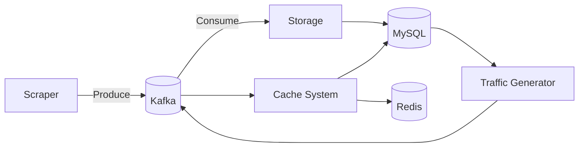

# 🚦 Plataforma Distribuida para Monitoreo de Tráfico en Tiempo Real

Plataforma distribuida para la recolección, procesamiento y análisis en tiempo real de datos de tráfico urbano usando fuentes públicas como Waze.

[](https://www.docker.com/)
[](https://kafka.apache.org/)
[](https://www.python.org/)
[](https://www.selenium.dev/documentation/webdriver/)
[](https://www.mysql.com/)
[](https://redis.io/)

---

## 📦 Components

1. **Scraper** 🧠: Recopila eventos desde Waze Live Map  
2. **Storage** 📦: Almacena los eventos en MySQL  
3. **Traffic Generator** 🎯: Simula las querys de usuarios con distintas distribuciones
4. **Cache System** 🧊: Recibe las consultas simulando un sistema caché

---

## 📌 Descripción

El sistema extrae, almacena y analiza datos de tráfico en tiempo real desde Waze, utilizando una arquitectura modular con:

- **Kafka** para mensajería distribuida
- **Selenium** 
- **MySQL** para almacenamiento persistente  
- **Redis** como sistema de caché de alto rendimiento  
- **Docker** para contenerización y despliegue  

---

## 📊 Diagrama de Arquitectura


| 🌐 Servicio          | 🔢 Puerto | 📝 Descripción              |
|---------------------|-----------|------------------------------|
| 🧭 Zookeeper         | 2181      | Coordinación de Kafka        |
| 💬 Kafka             | 9092      | Broker de mensajes           |
| 🗄️ MySQL             | 3306      | Base de datos relacional     |
| ⚡ Redis             | 6379      | Sistema de caché distribuido |
| 🧠 Scraper           | -         | Extracción de datos de Waze  |
| 📦 Storage           | -         | Almacenamiento de eventos    |
| 🎯 Traffic Generator | -         | Generador de consultas       |
| 🧊 Cache System      | -         | Cache con políticas híbridas |


## 🚀 Quick Start

```bash
git clone https://github.com/TheRamdomX/Proyecto-Distribuidos.git
cd Proyecto-Distribuidos
docker-compose up --build
```
